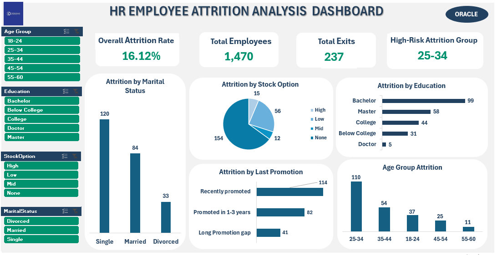
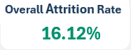
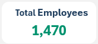

📊 HR Employee Attrition Analysis

📌 Project Overview

This project analyzes employee attrition trends using an interactive Excel dashboard. The objective was to identify the key demographic and organizational factors associated with employee turnover and provide actionable insights that can support workforce planning and retention strategies.

The dashboard was developed using Microsoft Excel and leverages Pivot Tables, Pivot Charts, Slicers, and KPI cards to transform HR data into a user-friendly decision-support tool.

## Dashboard Preview

## Key Performance Indicators

### Overall Attrition Rate

### Total Employees

### Total Exits

### High Attrition Age Group

---

🎯 Business Problem

Employee turnover can significantly impact organizational performance through increased recruitment costs, productivity loss, and knowledge gaps. This analysis seeks to answer the following questions:

What is the organization's overall attrition rate?

Which employee groups experience the highest turnover?

How does attrition vary by age, education level, marital status, promotion history, and stock option participation?

Which workforce segments require immediate retention interventions?

---
🛠️ Tools & Techniques

Microsoft Excel

Pivot Tables

Pivot Charts

Interactive Slicers

KPI Cards

Data Cleaning & Transformation

Dashboard Design & Data Visualization

---

📊 Key Performance Indicators (KPIs)

Metric value 

Overall Attrition Rate	16.12%
Total Employees	1,470
Total Employee Exits	237
Highest Risk Age Group	25–34 Years

---

📈 Dashboard Features

Interactive Filters

The dashboard includes slicers that allow users to dynamically filter analysis by:

Age Group

Education Level

Stock Option Category

Marital Status

Visualizations Included

Attrition by Marital Status

Attrition by Education Level

Attrition by Stock Option Participation

Attrition by Promotion History

Attrition by Age Group

KPI Summary Cards

---

🔍 Key Findings

1. Young Professionals Drive Attrition

Employees aged 25–34 years recorded the highest number of exits (110 employees), making them the organization's most vulnerable workforce segment.

This suggests potential challenges related to career progression, compensation expectations, or job satisfaction among early-career professionals.

---

2. Single Employees Show the Highest Turnover

Attrition among marital groups revealed:

Marital Status	Exits

Single	120
Married	84
Divorced	33

Single employees account for more than half of all recorded exits, indicating a higher propensity for job mobility within this group.

---

3. Bachelor's Degree Holders Experience the Most Attrition

Employee exits by education level show:

Education Level	Exits

Bachelor	99
Master	58
College	44
Below College	31
Doctor	5

Bachelor's degree holders recorded the highest turnover, suggesting that retention strategies may need to focus on mid-level professionals seeking career advancement opportunities.

---

4. Employees Without Stock Options Are More Likely to Leave

Attrition by stock option category indicates:

Stock Option Level	Exits

None	154
Low	56
Mid	12
High	15

Employees without stock options accounted for approximately 65% of all exits, suggesting that equity-based incentives may positively influence employee retention.

---

5. Recently Promoted Employees Still Recorded Significant Exits

Promotion history analysis revealed:

Promotion Status	Exits

Recently Promoted	114
Promoted in 1–3 Years	82
Long Promotion Gap	41

Despite recent promotions, attrition remains substantial, indicating that promotion alone may not fully address retention challenges.

---

💡 Recommendations

Based on the analysis, the following actions are recommended:

Develop targeted retention programs for employees aged 25–34.

Strengthen engagement initiatives for single employees who demonstrate higher mobility.

Review compensation and career development pathways for Bachelor's degree holders.

Expand stock option participation and long-term incentive programs.

Conduct employee satisfaction assessments to identify factors driving exits even after promotions.

---

📂 Repository Structure

HR-Employee-Attrition-Analysis/
|
│
├── HR_Attrition_Dashboard.xlsx
│  
│
├── Presentation/
│   └── HR_Attrition_Presentation.pptx
│
├── Documentation/
│   └── HR_Attrition_Report.docx
│
├── Images/
│   └── Dashboard_Screenshot.png
│
└── README.md

---

🚀 Skills Demonstrated

HR Analytics

Data Cleaning

Data Visualization

Dashboard Development

Business Intelligence Reporting

Excel Analytics

KPI Development

Data Storytelling

Stakeholder Communication

---

📖 Project Outcome

This project demonstrates my ability to transform raw HR data into actionable business insights through interactive dashboard development. By combining analytical thinking with effective visualization techniques, I created a decision-support tool that enables HR leaders to identify workforce risks and implement evidence-based retention strategies.

---

👤 Author

Chidinma Chime

Data Analyst | Economist | Excel Dashboard Developer

📍 Passionate about transforming data into actionable business insights.
